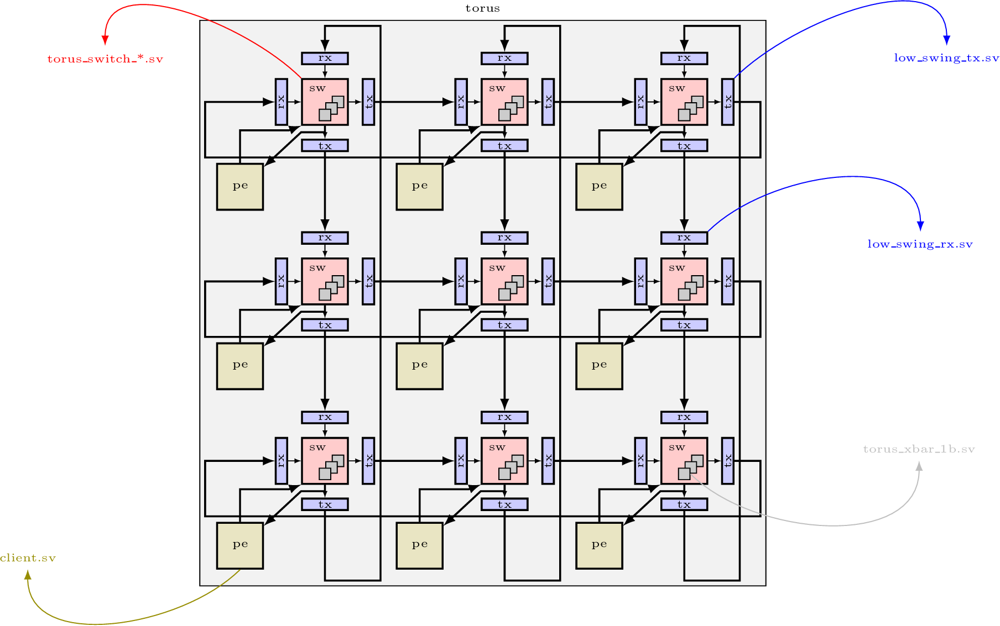

## Lab 5: Assemble Torus NoC, and map it to FPGA, ASIC, and Full-custom backends.
Deadline: December 3rd 2024

## Getting Started
First, clone the git repository onto your home directory on the ECE lab server.

```zsh
mkdir -p $HOME/ece720t7-f24/labs
cd $HOME/ece720t7-f24/labs
git clone ist-git@git.uwaterloo.ca:ece720t7-f24/labs/t3rampal-lab5.git
cd t3rampal-lab5
```

## Lab Objectives
The goal of this lab is to integrate all the building blocks from the previous labs to create a complete NoC. You will first ensure functional correctness of the assembled logic with Verilator, and then begin the fun hardware mapping.



### Functional Tests
For functional tests:

1. From Lab1, take your `torus_xbar_1b.sv` file. Make sure to add dummy `p2s` and `p2e` signal and rename the XtoY signals as X2Y! Sorry this is my brain fart!
2. From Lab3, take your `dor*.sv` files and `torus_switch_*.sv` files.
There's new logic for `done` we have supplied. A minor suprise may be naming .v to .sv but functionality is identical for now.
3. From Lab4, take your `client.sv` for functional tests. We have again
supplied logic to create `done` and left a hint.
4. For each of the three NoCs `torus.sv`, `torus_bp.sv`, and `torus_credit.sv` fill in the nested loop body. Use your Lab2 `torus.sv`
       as a guide for how to stitch things together. Be careful to instantiate
       `low_swing_tx` at East and South outputs and `low_swing_rx` before North
       and West inputs of each NoC switch. For backpressure switches, you will
       be the low swing instances for the backpressure signal and for credit,
       yoy will need them for the credit interface: note that you'll have to
       unpack each bit from the SystemVerilog interface to do so.

To grade your code,
```zsh
$ ./grade_verilator.sh
```

To run per-NoC test,
```zsh
$ make TEST=torus VCD=1
$ make TEST=torus_bp VCD=1
$ make TEST=torus_credit VCD=1
```

### FPGA and ASIC Floorplanning

The key task of the FPGA and ASIC implementations is to floorplan the NoC across the FPGA/ASIC fabric, for both folded and non-folded layouts. The floorplan should look roughly similar to the following:


`create_floorplan.py` uses `get_mappings` from `mapping.py` to retrieve a list of `BlockDesc` classes. It then formats this list into the proper commands to create an ASIC or FPGA floorplan.
Each `BlockDesc` object should contain a unique `block_name`, optional `block_type` (for debugging if needed), list of instances (`objs`) to be placed inside the group, and a list of rectangles that define the boundaries of the instance group `rects`.

For example, one switch group be the following:
```
BlockDesc(
    block_type = 'switch',
    objs = ['yx[0].xs[0].switch'],
    rects = [
       Rect(x_start = 10, y_start = 10, x_end = 20, y_end = 20)
    ],
    block_name = 'poly_0_0_sw'
)
```

In this lab, you will be modifying `get_bounding_box_size`, `get_box_start`, and `get_box_components`.
Information about the dimensions of the fabric can be found in `ChipInfo`  instance passed to the functions, e.g `info.y_start, info.y_end, info.x_start, info.x_end` for the minimum and maximum fabric locations, and `x_nodes`, `y_nodes` for the NoC dimensions.

1. `get_bounding_box_size`: Returns `x_size, y_size` of the larger logical bounding box a coordinate (green outline in the diagram).
2. `get_box_start`: Return the lower left coordinate (of green outline) given an x and y. Make sure to consider folded scenarios.
3. `get_box_components`: Returns a mapping of the switch, client, low swing rx, and low_swing_tx for within the box. For simplicity, these are relative to the lower left corner. 
For this lab, the rectangle locations and block_names have been filled out for you. 
All you need to do is add instances to the proper groups. Further comments can be found in the `mapping.py file`

### FPGA Mapping and Floorplanning
To run Vivado,
```zsh
$ make fpga-run
```

### ASIC Mapping and Floorplanning
To run ASIC flow
```zsh
$ make asic-run
```

### Full-Custom Mapping and Floorplanning
The grand finale is to assemble the `torus_xbar_1b`, `low_swing_tx`, and
`low_swing_rx` blocks from the transistor-level design labs to make a more
compact NoC than the ASIC standard-cell flow.

```zsh
$ make asic-customcell-run
```

## Submission

Finally, to run all tests and view your final grade, run `./grade.sh`. The gradewill be calculated and stored in `grade.csv`. The grade you see will be the
autograder output as well.

To submit your code please run the following.
```zsh
$ git commit -a -m 'the content of this message does not matter'
$ git push origin master
```
