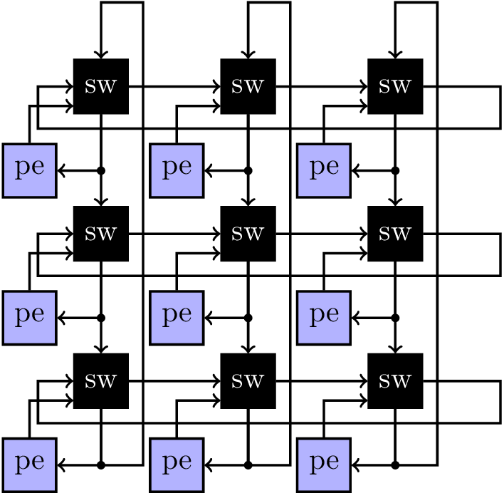
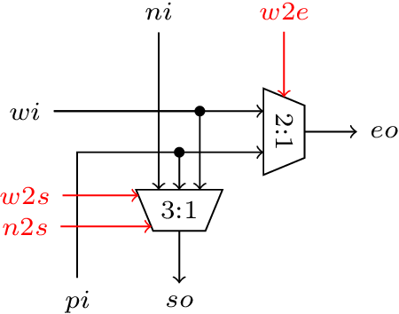
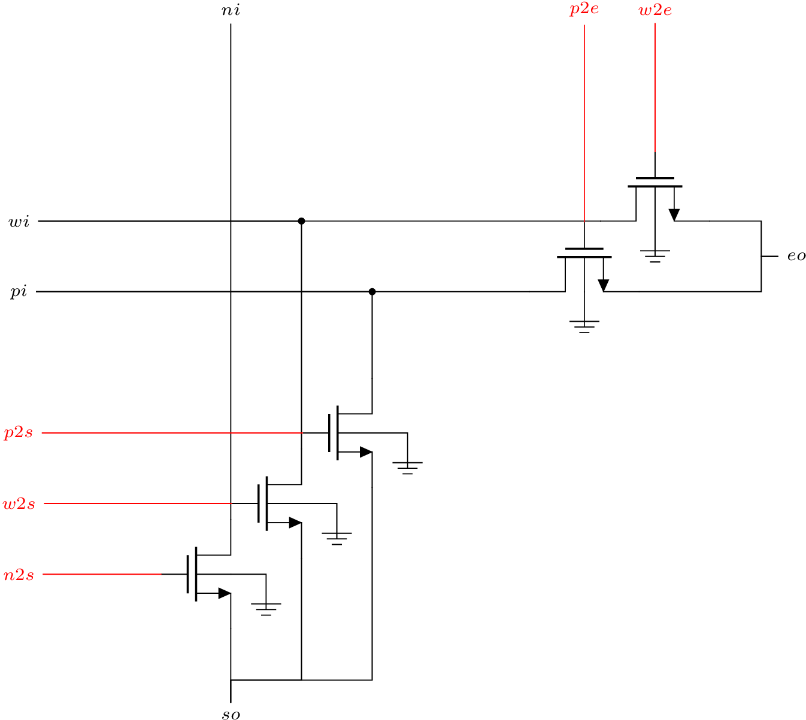

## Lab 1: Design a 1-bit crossbar in Verilog targeting FPGAs and ASICs
Deadline: September 27th 2024

## Getting Started
First, clone the git repository onto your home directory on the ECE lab server.

```zsh
mkdir -p $HOME/ece720t7-w24/labs
cd $HOME/ece720t7-w24/labs
git clone ist-git@git.uwaterloo.ca:ece720t7-w24/labs/t3rampal-lab1.git
cd t3rampal-lab1
```

## Lab Objectives
The goal of this lab is to design a 1-bit crossbar switch for a torus
network-on-chip, implement it in Verilog (FPGA and standard-cell ASIC
implementation), Schematic + Layout (full-custom MOS implementation).
You will functionally verify your Verilog with a digital testbench we supply,
and your schematic/layout with an analog testbench we supply.

Pre-Requisites:
- `verilog` manual for those unfamilar. https://git.uwaterloo.ca/ece720t7-f24/manuals/verilog
- `hw-sim` manual for digital simulations. https://git.uwaterloo.ca/ece720t7-f24/manuals/hw-sim
- `fpga-impl` manual for FPGA implementation. https://git.uwaterloo.ca/ece720t7-f24/manuals/fpga-impl
- `asic-impl` manual for ASIC (standard-cell) implementation. https://git.uwaterloo.ca/ece720t7-f24/manuals/asic-impl
- `fullcustom-impl` manual for Full-Custom implementation. https://git.uwaterloo.ca/ece720t7-f24/manuals/fullcustom-impl

A torus NoC is organized as shown below.


The NoC has horizontal and vertical rings that intersect in a 2D pattern. The rings have wraparound edges so packets on the NoC can circulate within the ring. Packets in vertical and horizontal rings can switch dimensions at the crossover switches or router. In this lab, we will design a 1-bit crossbar that allows this dimension change. We will only support a specific set of connections (more on why we only do this later in Routing Algorithms/Deadock lectures).

Logical View

 

Transistor-Level Schematic View



The Verilog crossbar module `torus_xbar_1b.sv` should have the following ports and names:

### Top-Level IO

torus_xbar_1b:
1. `wtoe`: 1 bit input, should west be routed to east
2. `wtos`: 1 bit input, should west be routed to south
3. `ntos`: 1 bit input, should west be routed to south
4. `ni`: 1 bit, north input
5. `wi`: 1 bit, west input
6. `pi`: 1 bit, pe input
7. `so`: 1 bit, south output
8. `eo`: 1 bit, east output
 
The schematic version has a few extra inverted control signals to avoid inverters in layout:

9. `ptoe`: 1 bit input, should pe be routed to east (could be !wtoe)
10. `ptos`: 1 bit input, should pe be routed to south (could be !(wtos|ntos))


For full-custom implementation, you will need to develop a schematic using NMOS
transistors. This must be done entirely using a GUI.

### Description:
- Packets from North can only go South. Packets from West can go South or East. Packet from the PE input can go South or East.
- Thus, the South exit port is a 3:1 multiplexer with North, West, and PE as inputs. The East exit port is a 2:1 multiplexer with West and PE as inputs.
- There is no clock and reset, so this is a purely combinational circuit (for now).

## Verilog Simulation

To simulate your design, type
```zsh
make verilator-sim
```

This will run a test with a bunch of inputs from a stimumus file that is generated randomly. There is a golden output that should match your implementation.

To get a waveform for debugging, you can generate a a VCD trace is desired.
```zsh
make verilator-sim VCD=1 
```

## FPGA Implementation

To run FPGA implementation, type
```
make fpga-run
```
The result should have an area of 2 LUTs. No timing information is available as
there are no clocks.

## ASIC Implementation
To run ASIC implementation, type
```
make asic-run
```
The result should have an area of ~60 um^2. No timing information is available
as there are no clocks.

## Full-Custom Implementation
The objective here is to implement the transistor-level schematic with 5 NMOS
transistors in the Schematic Editor and then perform Layout. You will use the
same flow as the `fullcustom-impl` manual but map 5 transistors instead of 2.

After schematic entry, run a schematic extaction step and then run a SPICE
simulation 
```zsh
make schex
make schematic-spice-sim
```

After layout, run LVS and DRC steps
```zsh
make lvs-step
make drc-step
```
TODO: Tentatively if your DRC violations, talk to the TA via Piazza to get them
resolved. 

If LVS and DRC are clean, run a parasitic extraction and simulation
```zsh
make pex-step
make layout-spice-sim
```

We will confirm that LVS and DRC are clean and the SPICE simulation waveforms
match expected outputs.

## Submission

Finally, to run all tests and view your final grade, run `./grade.sh`. The grade
will be calculated and stored in `grade.csv`. The grade you see will be the
autograder output as well.

To submit your code please run the following.
```zsh
$ git add cds.lib tech.lib 
$ git add ece720t7/*
$ git commit -a -m 'the content of this message does not matter'
$ git push origin master
```
