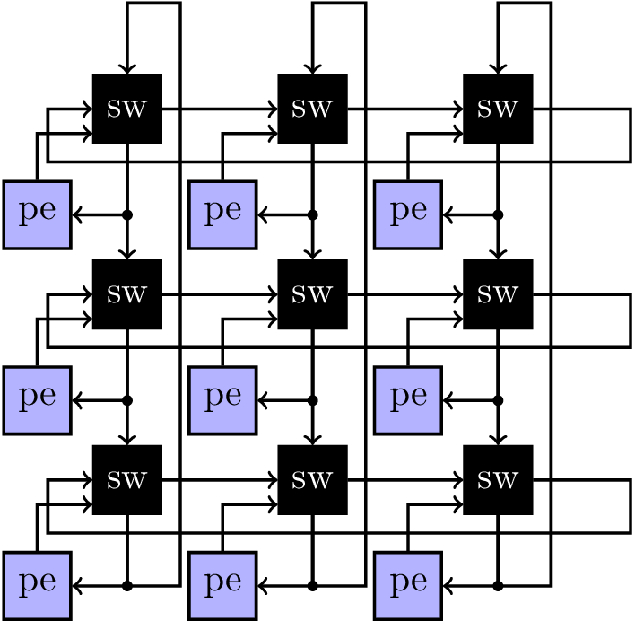

# Lab 2: Topology construction of a Torus NoC
Deadline: October 22nd 2024

## Getting Started
First, clone the git repository onto your home directory on the ECE lab server.

```zsh
mkdir -p $HOME/ece720t7-f24/labs
cd $HOME/ece720t7-f24/labs
git clone ist-git@git.uwaterloo.ca:ece720t7-f24/labs/t3rampal-lab2.git
cd t3rampal-lab2
```

## Lab Objectives
The goal of this lab is to 
1. Design parametric Verilog for a 1D unidirectional torus NoC. 
2. Design and characterize (power, delay) schematic and layout for low swing transmitter and receivers.

Pre-Requisites:
- `verilog` manual for those unfamiliar. https://git.uwaterloo.ca/ece720t7-f24/manuals/verilog
- `hw-sim` manual for digital simulations. https://git.uwaterloo.ca/ece720t7-f24/manuals/hw-sim
- `fullcustom-impl` manual for Full-Custom implementation. https://git.uwaterloo.ca/ece720t7-f24/manuals/fullcustom-impl

## Verilog for Torus NoC

A torus NoC is organized as shown below.


You will create Verilog for your torus NoC in the file `torus.sv`. You will have to instantiate the clients and routers in a 2D grid using nested generate for loops. And you will then have to wire up the clients to the routers and routers to each other using the loop indices.
The torus has Verilog parameter dimensions `X_MAX` by `Y_MAX` while packet address will have source and destination address bits (`X_W`, and `Y_W`) + payload bits `D_W`.  

The following are the I/O ports of the torus NoC `torus.sv`:

1. `clk` : 1 bit input
2. `rst` : 1 bit input


The following are the I/O ports of the provided router module `router.v`:

1. `clk` : 1 bit input
2. `rst` : 1 bit input
3. `n_in` : 1 + D_W + X_W + Y_W bit input, for input from north
4. `w_in` : 1 + D_W + X_W + Y_W bit input, for input from west
5. `i` : 1 + D_W + X_W + Y_W bit input, for client input
6. `i_ack` : 1 bit input, for telling client if the input was accepted this cycle
7. `s_out` : 1 + D_W + X_W + Y_W bit output, for southbound output
8. `e_out` : 1 + D_W + X_W + Y_W bit output, for eastbound output 
9. `o_v` : 1 bit output, tells the client if output is valid for this node
10. `X`: The X-position of the router encoded in X_W bits
11. `Y`: The Y-position of the router encoded in Y_W bits

The following are the I/O ports of the provided client module `client.v`:

1. `clk` : 1 bit input
2. `rst` : 1 bit input
3. `i` : 1 + D_W + X_W + Y_W bit input, for input (output from client, input to router)
4. `i_ack` : 1 bit input, for telling client if the input was accepted this cycle
5. `o` : 1 + D_W + X_W + Y_W bit output, for output (input to client, output from router)
6. `o_v` : 1 bit output, tells the client if output is valid for this node
7. `X`: The X-position of the router encoded in X_W bits
8. `Y`: The Y-position of the router encoded in Y_W bits

Note that the router implementation will be provided to you as an encrypted post-synthesis Verilog module, you will design different variants of the router itself in Lab3.

### Verilog Simulation

Once you've implemented the Verilog for the torus NoC, you can simulate it as follows:
```
make run
```

The test will inject packets into the network and route them to their destinations if the torus routers have been correctly connected. If not, the test will fail and let you know which packets were not received.

## Low-swing drivers for NoC wires

In this section of the lab, you will do transistor-level design of a transmitter and receiver circuit and quantify delay and power. Instead of driving 0->1V swing, we will adjust this to a lower swing 0->0.5V (or whatever voltage necessary) to ensure correct transmission of data.

The transistor-level schematic of the transmitter and receiver are shown below:

Transmitter `low_swing_tx` | Receiver `low_swing_rx` |
:----:|:----:|
 | 

The key idea here is to size the W/L of these transistors to ensure correct transmission of data at lower swing i.e. lower power without introducing too much delay. Thus, we have to not only discover the right W/L sizes, but also optimize these choices to balance power and delay.

To implement this portion of the lab, do the following:
1. Create the `ece720t7` library and attach it to TSMC 65nm library as before.
2. Make two new symbols `low_swing_tx` and `low_swing_rx` for schematic entry. Use the schematic editor as before to create these simple transistor designs. 
Note: transmitter transistors are `nch` and `pch` type you have seen before. For the PMOS drivers (blue region) define the transistor width finger as `F` in the transistor information dialog box. This will calculate width as `W*F`. The first inverter in the receiver will be `nch_hvt` and `pch_hvt` high-threshold voltage variety to ensure low swing will be detected correctly. The second inverter will be `nch` and `pch` type. Remember this during schematic entry. Check transistor sizing guide below for advice on how to set W/L properties. 
3. Export the schematic to spice using `make schex`. This will generate the SPICE netlists `low_swing_tx_schematic.sp` and `low_swing_rx_schematic.sp` files in the `spice/` folder. Here is where the fun begins.
4. In the `spice/` folder, run SPICE simulations using `make tx` and `make rx` commands until output swing is correct and matches expected digital reception. i.e. if the swing is too aggressive, the output won't ever get detected as logic level 1, etc. You can check the waveform with `make tx-wv` or `make rx-wv` commands. They may look like the following, with incremental changes to W/L adjusting swing. 

5. The process will now be an iterative step and you have to populate the sweep files `tx_sweep.dat` and `rx_sweep.dat` with your desired combinations of W/L values you think will work. The SPICE simulation testbench will explore various W/L combinations that you specify. Check the transistor sizing guide below for advice on how to approach this problem. 
6. At the end you will have potentially several W, L combinations that work. How do you pick the best one? We have provided the `make plot` command to help you visualize the different power-delay combinations. You can reduce power at the cost of more delay. First, make sure that the low swing drivers are better than the baseline `make baseline` power. Then pick a W,L combination you think balances power reduction and delay increase. Maybe a power-delay product metric might work? Play with it! This experiment is designed for a 90fF wire capacitive load. The W/L combination will change for different capacitive loads (more in Lab5).
7. Once you have figured out the correct W/L values for all transistors, edit your schematic to reflect these optimized transistor widths. Make sure to select 'fingers' F to ensure the layout import works correctly. 
8. Perform layout that matches a golden reference picture we will provide once your schematic simulations work correctly. Routing will need to be done manually for this small design to ensure a tight fit. Hopefully this simplifies the layout compared to Lab1 as you do not have to figure out how to do the layout.
9. Do layout-vs-schematic tests and post-layout simulations using `make lvs-step`, `make pex-step` + `make layout-spice-sim`, and `make drc-step`.

### Transistor Sizing guide for low-swing drivers

The objective of this guide is to advise you how to populate `rx_sweep.dat` and `tx_sweep.dat` files. The HSPICE parameter sweep methodology uses these files to run several SPICE simulations at the specific combinations. You can then determine visually or automatically how you want to select the winning combination of W/L parameters. These files have a dummy combination there right now, you must think of how to conduct the trial-and-error or intelligent search.

Traditionally, for 65nm tech, transistor W of PMOS is set to 2x that of NMOS due to higher electron mobility. For newer 7nm tech with FinFets the gap in W is vanishing. We are using 65nm for this lab.

The goal of the low swing transmitter is to limit the amount of time available to drive the interconnect without sacrificing current driving capability. Input to the transmitter is `i` and output is `c`. Internal signals `a` and `b` must be carefully designed as follows.

1. The time limiting feature is achieved by delaying `a` and `b` with respect to each other by a certain amount $\delta$. This $\delta$ depends on the delay in the inverter chain (blue region), which in turn can be increased by increasing L of the middle two inverters in the 4-inverter chain. Larger L => Larger delay => More time to charge output wire. 
2. The driver stack (blue region) of 2 PMOS and 1 NMOS transistor is designed to connect the long interconnect wire to $V_{DD}$ only when `a and b` are low. If a is high, the NMOS will immediately drive output wire to $V_{ss}$. Thus, the condition `a and b = 0` turns on the charging process. The size of the PMOS and NMOS in this driver stack will determine how much current is available to drive the output wire. Thus, we want the W of the PMOS/NMOS to be larger. Larger W => Lower resistance => Larger current => Can charge up to desired low swing V quickly.
3. Finally, to control rise and fall times the W/L of the first and last inverter in the chain producing `a` and `b` signals must be kept standard.

For the low swing receiver, we must correctly detect the low voltage swing as
digital logic 0 and 1. The receiver is much simpler and is just two inverter
stages. By using high threshold voltage high Vt transistors for the first
inverter, we can make sure the transistor operates correctly even with reduced
swing! The PMOS transistor will switch on the falling curve when gate voltage
crosses $V_{DD} - V_{tp}$. With high Vt transistors $V_{tp}$ is high thereby
allowing a lower voltage swing to trigger the MOSFET switching criteria. Here,
we must choose the transistors W/L combinations to ensure fast rise and
fall times. For simplicity of design, both inverters can use same W/L values.

This means we have the following variables
- W1 L1 for the first and last inverter (red region)
- W2 L2 for the second and third inverter (red region)
- W3 L3 F for the pull-up PMOS transistor pair (blue region, specified as fingers
        i.e. multiples of a base W. Thus, actual transistor width will be W3*F)
- W4 L4 for the pull-down NMOS transistor (blue region)
- W5 L5 for the receiver transistors (receiver)

Your goal is to carefully select the W1/2/3/4/5, L1/2/3/4/5 values. 

Hint: Set L1, L3, L4, and L5 to minimum length L (60e-9). Set W1 to minimum W(120e-9). This should limit search to W2, L2, W3, W4, and W5 only, just four variables. 

We have seeded the `tx_sweep.dat` and `rx_sweep.dat` files with minimum length/width for all transistors, which is just wrong! LOL

### Command Reference

```zsh
make schex
make schematic-spice-sim
make lvs-step
make drc-step
make pex-step
make layout-spice-sim
```

## Submission

Finally, to run all tests and view your final grade, run `./grade.sh`. The grade
will be calculated and stored in `grade.csv`. The grade you see will be the
autograder output as well.

To submit your code please run the following.
```zsh
$ git add cds.lib tech.lib 
$ git add ece720t7/*
$ git commit -a -m 'the content of this message does not matter'
$ git push origin master
```

